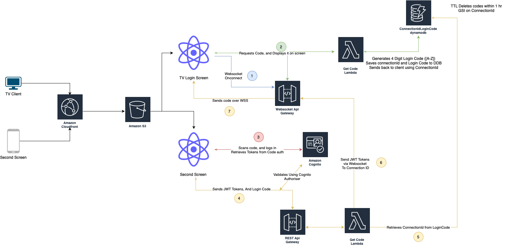

# Second Screen Sign On AWS Demo

## What is it?

Second Screen Sign On is a feature of many web apps, especially those that have TV Apps, that allows the user to sign in from another device, such as a smart phone or laptop, and have the TV Login simulataneously. 

This feature piqued my curiousity, and I wanted to see whether it would be possible to design an entirely serverless version of it, using common AWS technologies. 

While this application does not run on a television currently, the underlying technologies are the same - HBBTv supports all of the technologies used here-in, so porting to a tv would be simplistic. 

## Goal 

The goal of this application is to create a highly available, scalable version of a Second Screen Sign on, one that is pay as you use and can scale to millions of users. 

There will be no functionality beyond the initial second sign on, but we will show some evidence of the user being logged in. 

## Demo 

https://www.podginator.com has a working example. 

## Technologies used

* React - For the front end application 
* Barcode.js to generate the QR Code. 
* S3 and Cloudfront for Hosting the WebApp. 
* AWS Cognito for OAuth2 Login and User management. 
* Amazon API Gateway and Websockets for communication between the devices. 
* AWS Lambda
* DynamoDB 
* AWS SDK - Typescript 
* Github actions for CI CD 

## Architecture 

